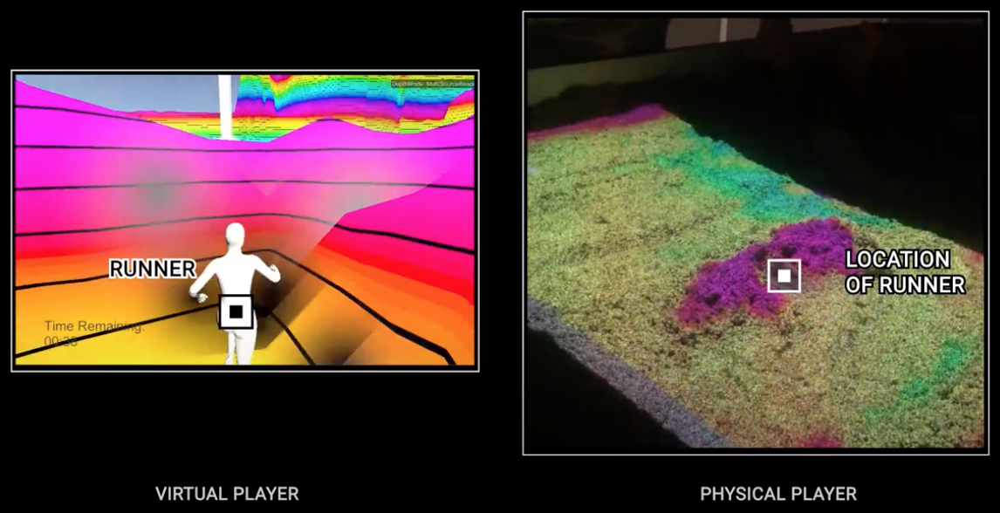

# AR Sandbox

_Project created for the [Engineering Interactive Technologies](https://seongkookheo.com/cs4501-spring2021/) course at the Univesrity of Virginia, taught by [Professor Seongkook Heo](https://seongkookheo.com/)_

### Documentation
---
- [Project Proposal](https://www.overleaf.com/read/wgnyqnknmmcm)
- [Final Project Presentation](https://docs.google.com/presentation/d/1sEQX8oWIWI3VvAlZOpVMlpWuZyBj77bkUjClbHFpCE8/edit?usp=sharing)
- [Final Project Report](https://www.overleaf.com/read/rnbfvvnfvztt)
- [Demo Video](https://drive.google.com/file/d/1acO-HVBVXyqdXZPJiVDW8KVNY_vzHG0E/view?usp=sharing)

### Software
---
- [Unity version 2019.3.15.1f](https://unity3d.com/get-unity/download/archive)
- [Unity Standard Character Assets](https://github.com/Unity-Technologies/Standard-Assets-Characters)

### Hardware
---
- [Microsoft Kinect2](https://developer.microsoft.com/en-us/windows/kinect/)
- [EM River 4](https://emriver.com/models/em4/)

### Contributors
---
- Xun Liu (@xunliuDesign)
- Nidhi Manu (@NidhiManu)
- Nichole Chheng (@nicolechheng)
- Alan Wang (@yaoeh)
